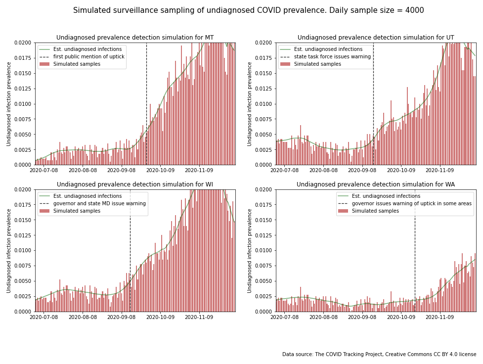
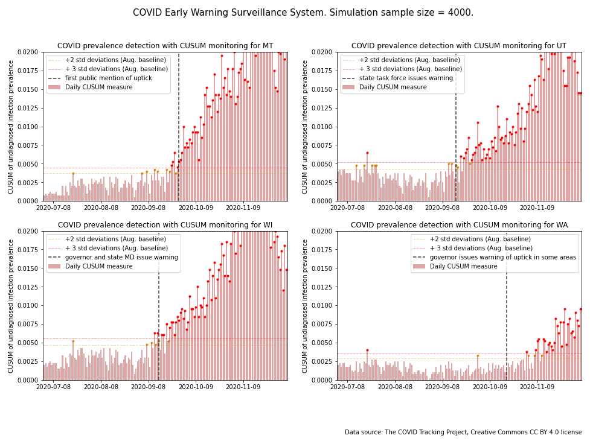

# COVID Early Warning System Project Overview

This project is an attempt to define a good early warning indicator for COVID outbreaks. States and public health agencies have a difficult job to keep COVID transmission under control while simultaneously managing their economies and battling pandemic fatigure. One of the keys to controlling infections is a system that provides governments with an early and accurate warning of an increase in new COVIC infections in their jurisdiction. How good is the data that they are currently using at providing that early indiactor? Is there a way to improve upon the timeliness and accuracy of the warning?

## Part 1: COVID Early Warning System Data Analysis

This project grew out of an interest to compare the available data from states that had experienced an outbreak vs. states that hadn't experienced an outbreak. As the analysis progressed it became clear that the common statistical measures of COVID-19 infection spread that are utilized today--total cases, case rates, and positive test rates--all have their shortcomings. The essential problem is that the data feeding into these measures comes from two distinct populations--people who are symptomatic and those who are asymptomatic. These two populations have different rates of infection. Tests from both populations are combined in a haphazard fashion making statistical comparisons from one day to the next or one state to the next problematic. The data source issues don't impact all measures equally. The study identifies case rate as the one metric that most clearly and consistently correlates with outbreaks-albeit not as quickly or definitively as desired.

## Part 2: An Alternative COVID Early Warning System

The first part of this project (described in this repo) informs the second part--a proposed alternative regional COVID-19 early warning system ([described here](https://github.com/salvir1/part-2-covid-early-warning-system)). This second part addresses some of the shortcomings of the currently available tools to provide an earlier and more certain warning of an increase in new COVID infections. Simulations of these alternative concepts are modeled to compare its theoretical improvement in performance over current options. Ideally, a system like this could ultimately allow state governments and public health agencies to more accurate picture of COVID prevalence in their jurisdictions so that they know when they need to respond to keep an uptick from turning into an outbreak. 

## Goals

The high level goals of this project are:
- To characterize the difference at the regional level between an uptick and an outbreak in COVID case rates
- To develop statistics that could become the foundation of a COVID-19 earling warning system (described [here](https://github.com/salvir1/part-2-covid-early-warning-system))
- To work with various EDA and data visualization tools and techniques

## Tools and techniques used in this project

**Tools**
- Python, Jupyter Lab, SciKitLearn, Pandas, Numpy

**Visualization**
- Plotly, Matplotlib

**Techniques**
- Time series, clustering, spatial mapping, simple moving average, linear regression, simulation

## Raw data sourced from COVID Tracking Project

- Terms of use: The COVID Tracking Project at The Atlantic’s data and website content is published under a Creative Commons CC BY 4.0 license, which requires users to attribute the source and license type (CC BY 4.0) when sharing our data or website content.
- Citation: [the COVID Tracking Project](https://www.covidtrackingproject.com), Creative Commons CC BY 4.0 license

# Can we create a better COVID Early Warning System?

The exploratory data analysis (EDA) portion of this project highlighted two big shortcomings with the current methods used to monitor COVID infections in the general population ([click here](https://github.com/salvir1/part-1-covid-outbreak-analysis) for details). These shortcomings are considered below.

## Outbreaks grow faster than what the data shows

When an outbreak occurs, new active infections increase faster than what today's COVID case diagnosis metrics show. Two factors are behind this. Typically a positive diagnosis is made and enters a tracking dataset many days after infection. As a result, an outbreak may be emerging 6 or more days before it begins to appear in the metrics. The second factor relates to the size of the infected population. The CDC has been conducting large-scale  seroprevalence surveys (prevalence of antibodies to COVID in blood samples) in people across the country. They have found many times more people have antibodies than have been positively diagnosed. The actual number of new infections could be 2.5 times or more larger. The slope of the actual outbreak curve compared to the observed curve is correspondingly that much steeper.

The following *case rate* charts illustrate what the actual outbreak curve could look like compared to the chart of actual positive diagnoses. The green trendlines of estimated new infections are earlier and steeper than the smoothed *case rate* trendlines.

</img>

There are some additional points to make about the charts. These graphs have all been scaled to have the same y-axis scale. Vertical black lines have been added to indicate when state governments notified the public of what they viewed to be a concerning rise in cases this fall. (Ignore the red lines for now.) 

Three of the charts show case rates for states with outbreaks occurring in September. Based upon the estimated infections trendlines, new infections may have been on the rise for many days before state governments officially recognized them. It is also important to note that new infections continued to rise unabated after the outbreak was first noted publicly. The fourth chart from Washington state shows the governor issuing a warning about an emerging outbreak with the case rate much lower than the other states. The divergence of approaches between states underscores the fact that--even though so much is at stake--we don't have a commonly-accepted set of best practices that best balances the impact on peoples' lives and livelihoods.

Horizontal red lines were constructed from measures of August *case rate* mean and variability. The red lines have been added to demonstrate what could be a desirable statistical measure. The horizontal red lines are two standard deviations above the August mean rate. The vertical red lines indicate when the moving average first crosses the *two standard deviations* control line in the fall. This is a simple control chart approach to help to indicate when the mean of a time series is likely to have shifted with a certain degree of confidence--in this case two standard deviations or 95%. It is a flashing *warning signal* from the chart. This control line is a flawed statistic because of issues with the source data--which brings us to the second big shortcoming.

## COVID datasets mix data from two dissimilar populations 

Today's COVID tracking datasets mix diagnostic tests of symptomatic people with screening tests of asymptomatic people. The two populations have different means and different variability. They are not combined in any controlled fashion. Haphazardly mixing two very different test populations into one dataset reduces strength of inferences that can be made on new data is it comes in.

It's worth expanding on this. Most of the positive test results that feed into today's COVID tracking metrics come from confirmatory diagnostic testing of symptomatic people. Positive test rates for this subpopulation will be 25% or more. Numerous screening tests of asymptomatic people are also reported in the total test numbers. Positive test rates in this subpopulation will be much lower--closer to the prevalence of undiagnosed COVID within the larger population. Positive test rates are likely to be an order of magnitude lower. The proportion of these types of tests from one day to the next fluctuate significantly. One would expect any a lot of variation in the metrics that are based on these data--and there is ([click here](https://github.com/salvir1/part-1-covid-outbreak-analysis) for a more thorough analysis of this topic).

State governments and public health agencies face a daunting challenge of protecting peoples' lives and livelihoods during the COVID pandemic. Early intervention is critical to stemming an emerging outbreak which can in turn reduce economic impact. Good data is essential to timely decision-making. Good data is essential to having confidence in those decisions. There are several issues data underpinning many of the metrics in use today which impacts both the timeliness of and confidence in any decisions based on those metrics. 

## First pass simple early warning system

This notebook proposes variations of a COVID Early Warning System meant to address the shortcomings in current approaches.These variations are designed to create a *surveillance* system that measures the prevalence of undiagnosed COVID infections as opposed to statistics that rely on a haphazard mix of tests from confirmatory diagnoses of symptomatic people and screening tests from asymptomatic people. The statistics for these models are also designed using common statistical process techniques to allow for more certain decision-making.

The basic concept is to separate out the results from diagnostic testing from the results of screening tests and develop statistical measures of them separately. The *total cases* and *case rate* metrics would not change much from what is being reported today. Most of the reported positive diagnoses come from symptomatic people. The big change--which would be a major improvement--would be that the screening test data could now be looked at separately.

Reporting on undiluted screening test data may help to address both of the major shortcomings with the common COVID metrics in use today. The positive tests in the asympomatic subsample may come from people who are not yet symptomatic. As such, the postiives may come earlier in the infection cycle for this group. Also, the positive test rate would fairly accurately represent the active undiagnosed COVID infection prevalence in the larger population (with some error introduced because the samples wouldn't be perfectly random). This is obviously an important measure. Whereas longitudinal comparisons of today's *case rate* metrics are affected by testing availability, the *positive test rate* of the asymptomatic subsample shouldn't suffer the same problem.

If databases are already keeping track of patient status prior to testing (i.e. asymptomatic vs. symptomatic), then separating out the databases could be straightforward. If that's possible, here are examples of charts for the states above that could be produced with this data. The *prevalence of undiagnosed COVID* data points were simulated by generating a binomial random variable from the *estimated undiagnosed infection* trendlines. Since the *estimated undiagnosed infection* trendline stops a few days before the end of the time series, a linear regression was performed to complete the trendlines.

</img>

In two of the above charts it appears that the daily *undiagnosed infection prevalence* datapoints cross red horizontal line well before the state governments first issued public notices of upticks. In other words, the simulated data could conceivably have indicated the emerging outbreak sooner than the current metrics. 

Another important benefit is that the data won't suffer the same stationarity and homoscedasticity issues since data is not being mixed haphazardly from two very different populations. The data may be better-behaved and better-suited to common statistical process control tools like CUSUM sequential analysis. The charts below contain the same simulated data as the previous charts. Control lines have been added indicating if and when the means of the *prevalence of undiagnosed COVID* statistic cross the 2 standard deviation thresholds. The signals are clear and provide a much more statistically sound warning. 

</img>

## Contributors
[Rob Salvino](https://github.com/salvir1)

## License
[MIT ©](https://choosealicense.com/licenses/mit/)
